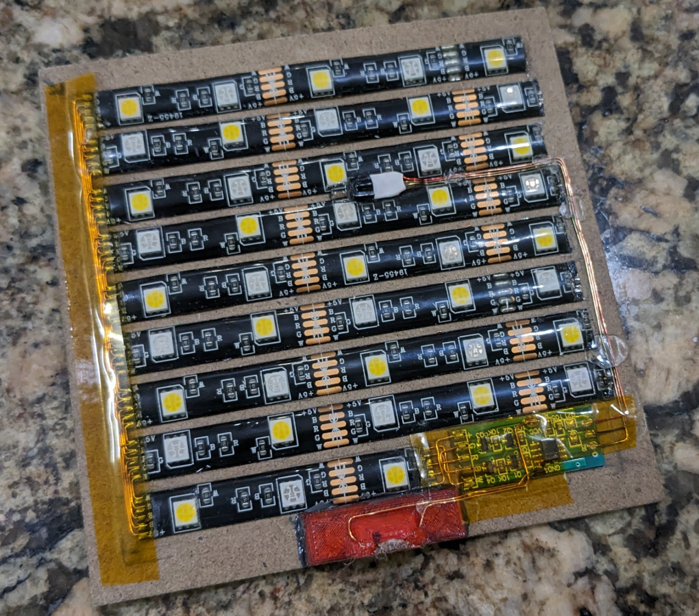
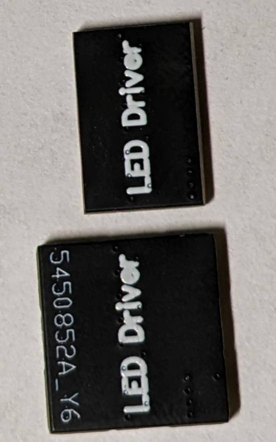
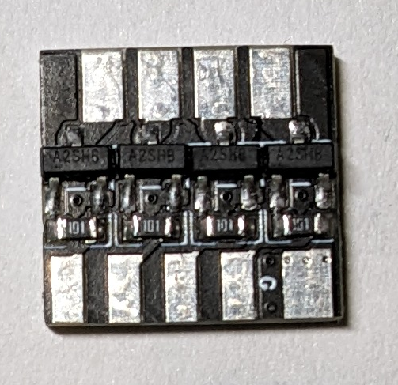
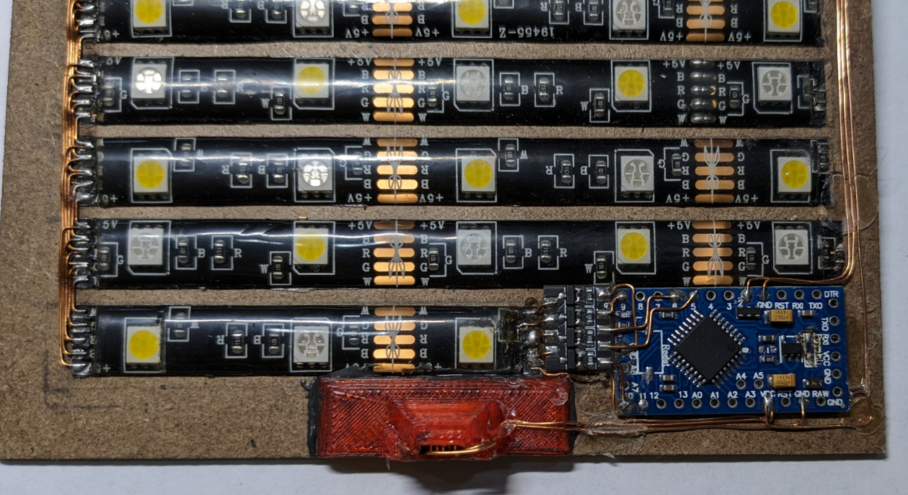
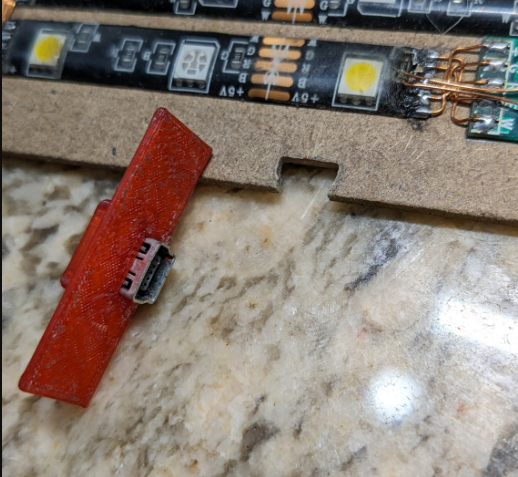
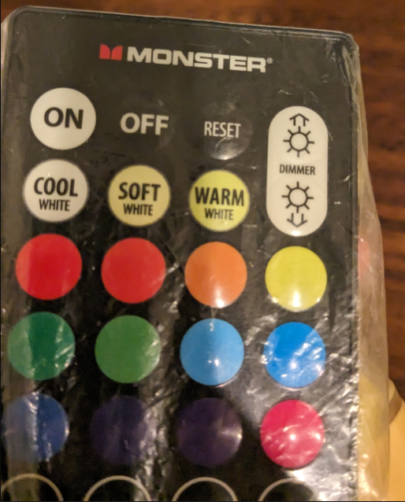
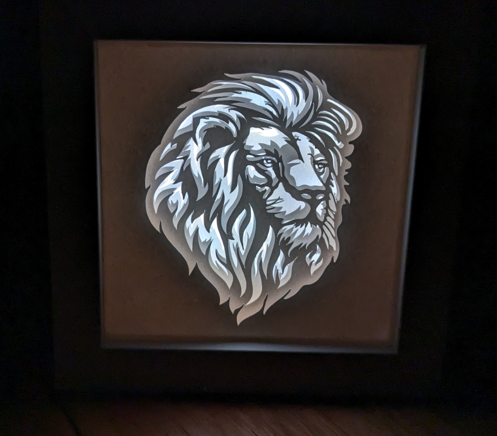

# IR-RGB-Controller - Amir Gorkovchenko (July - August 2023)

There are these project light boxes with paper and creative designs in front.
When the light shines from the back it creates a very nice effect.

As a gift, I wanted to create something more than just a single color of light.

The electronic design and code development was done by me but the paper design was cut by my brother in a collaborative effort.

## Project Goal
The goal of the lighting side of the project was to create a pleasant lighting effect with nice transitions and fades.
It would include lighting sequences and must be able to run endlessly as a decor item.
The remote can be used to program a sequence or adjust RGB colors as desired.

## Design
This project utilizes a cheap IR remote which was decoded and programmed into an Atmega328p processor.
The box consists of an array of RGB light strips and a custom PCB printed LED controller.

This was one of the most difficult LED macro projects that I had to program as it utilized multiple layers of LED macros processed on top of each other.
If any macro were to conflict with each other, unwanted jitter or unpleasant color changes would come as a result.

Creating an efficient system that managed each led macro was crucial to ensure smooth transitions and no undesired macro glitches.

This project required careful manual soldering to attach each led array in parallel.

## Photos

\
Custom pronted LED Drivers from JLC PCB:

\
Atmega328p and LED Driver:

\
3D printed USB mini holder:

\

IR Remote used:

\

Credit, My brother for cutting out the design:
